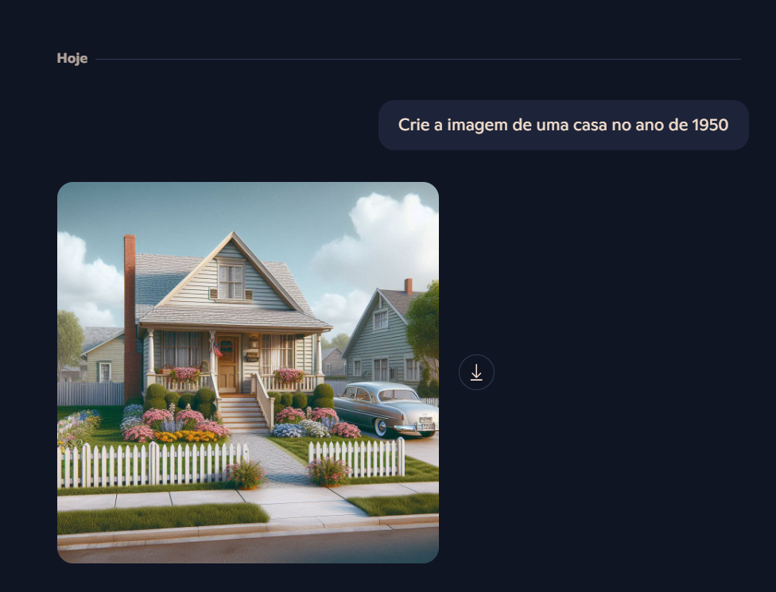

# IA Generativa: Insights e Possibilidades

Este projeto explora os conceitos de Inteligência Artificial Generativa, abordando como os modelos de IA podem gerar conteúdo original com base em dados de treinamento. A seguir, apresento alguns prints, descrições e insights que obtive ao estudar o tema.

## O que é IA Generativa?

A IA generativa é um campo da inteligência artificial que se foca em criar novos conteúdos como texto, imagens, música, etc., ao invés de apenas analisar ou classificar dados. Ela usa modelos de aprendizado profundo, como Redes Neurais Generativas Adversariais (GANs) ou Transformers, para gerar novos exemplos de dados que são semelhantes aos dados de treinamento.

## Processo de Criação

1. **Coleta de Dados**: 
   O primeiro passo é coletar dados de treinamento que representem o tipo de conteúdo que queremos gerar (texto, imagens, áudio).
   
2. **Treinamento do Modelo**: 
   A IA é treinada com esses dados usando técnicas de aprendizado supervisionado ou não supervisionado, ajustando os pesos e parâmetros para melhorar a precisão da geração.

3. **Geração de Conteúdo**: 
   Depois de treinado, o modelo pode gerar novos exemplos de dados que são similares ao que foi treinado. Exemplos incluem textos criados por modelos como GPT e imagens geradas por GANs.

## Exemplos de Resultados de Geração de Imagens com Microsoft Copilot

### Processo para gerar as imagens

## Insights

- **Criatividade Artificial**: A IA generativa pode ser uma poderosa ferramenta para criar conteúdo criativo, desde a escrita de histórias até a geração de imagens únicas.
  
- **Limitações**: Embora promissor, o modelo de IA generativa ainda tem limitações, como gerar resultados imprecisos ou incoerentes, especialmente em tarefas complexas.

- **Uso Ético**: A IA generativa pode ser usada para criar deepfakes ou espalhar desinformação. É importante desenvolver sistemas éticos e transparentes para evitar abusos.

## Possibilidades Futuras

- **Educação**: Modelos de IA generativa podem ser usados para criar materiais educativos personalizados e conteúdos interativos.
  
- **Design e Arte**: A IA pode ajudar designers e artistas a explorarem novas possibilidades criativas, gerando novos padrões e estilos.

- **Entretenimento**: Na indústria do entretenimento, IA generativa pode criar roteiros, personagens e mundos virtuais para jogos e filmes.

## Conclusão

A IA generativa representa uma nova era de inovação em várias indústrias, oferecendo tanto oportunidades quanto desafios. Com a evolução dos modelos e do uso ético, podemos esperar que ela desempenhe um papel significativo em muitos aspectos da criação de conteúdo digital.

---
